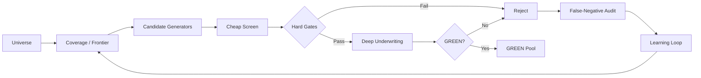

<div align="center">

# ⚡ Amazon Opportunity Engine

### An evidence-driven product discovery & underwriting system for finding exceptional Amazon opportunities — repeatedly.


**Discover broadly. Reject aggressively. Underwrite deeply. Learn continuously.**

</div>

---

## 🎯 Mission

Most product-research systems optimize for finding *more candidates*.

This system optimizes for something harder:

> **Finding a small number of unusually strong opportunities while rejecting bad capital deployments as early and cheaply as possible.**

The operating target is a pool of **20 products with genuine GREEN status**. The GREEN standard is not lowered to fill the pool.

---

## 🧠 Core philosophy

```text
Broad discovery
      ↓
Cheap falsification
      ↓
Hard gates
      ↓
Market structure
      ↓
Product + customer evidence
      ↓
Economics + capital efficiency
      ↓
Stress testing + red team
      ↓
GREEN pool
      ↓
Compare the survivors
```

The model is intentionally designed to say **no** most of the time.

A high score cannot rescue a fatal weakness. Missing critical evidence does not become optimism. A promising product is treated as a hypothesis until it survives underwriting.

---

## 🔭 Discovery engine

The discovery layer searches the Amazon opportunity universe through multiple independent paths rather than relying on one Black Box-style filter.

It combines signals such as:

- category and JTBD frontier exploration
- young-entrant success
- market fragmentation
- keyword and demand anomalies
- complaint clusters
- premiumization
- supplier and manufacturing changes
- dimensional / fee engineering
- cross-category migration
- replacement and compatibility friction
- external-to-Amazon signals
- workaround and substitution behavior
- temporal change detection

A dedicated exploration reserve protects the engine from becoming trapped by its own previous discoveries.

### The question we want the system asking

> **What changed materially, unexpectedly, and persistently — and is that change economically actionable?**

Not every anomaly is an opportunity. Change signals only generate hypotheses; they never bypass normal underwriting.

---

## 🛡️ Anti-bias design

A discovery system can become very good at finding what it already believes is attractive.

This engine therefore includes a **false-negative audit loop**: a small, stratified sample of rejected opportunities is periodically re-examined to detect whether specific gates, assumptions, or heuristics are killing real winners.



---

## 🧪 Engineering principles

| Principle | Meaning |
|---|---|
| **Gates before scores** | Fatal weaknesses cannot be averaged away. |
| **Evidence over narrative** | Observed, calculated, estimated, and unknown data stay separate. |
| **Parent-level market structure** | One successful ASIN is not a market. |
| **Post-ad economics** | Attractive gross margin alone is insufficient. |
| **Capital efficiency matters** | Profit is evaluated against working capital consumed. |
| **Explainability first** | Important decisions must be traceable to evidence and rules. |
| **Version everything** | Material model changes produce explicit versions and rollback paths. |
| **Learn from rejects** | A dead product can still reveal a live problem, supplier capability, or adjacency. |

---

## 🔄 Agile architecture

The engine is not silently rewritten when a new idea appears.

```text
observation / failure
        ↓
hypothesis
        ↓
experimental change
        ↓
old-vs-new comparison
        ↓
promote or reject
        ↓
versioned release
        ↓
monitor + rollback if needed
```

Major architectural changes receive new versions. Bugs receive patch versions plus an impact audit of prior decisions.

**v1.0 remains the rollback baseline. v1.1 adds discovery-quality enhancements without weakening the investment standard.**

---

## 🧩 Public showcase + private core

This project deliberately uses a two-repository architecture:

```text
PUBLIC — amazon-opportunity-engine
├── architecture
├── philosophy
├── sanitized examples
├── roadmap
└── progress / learnings

PRIVATE — amazon-opportunity-engine-core
├── exact model configuration
├── scoring + hard-gate logic
├── fee normalization
├── discovery heuristics
├── regression tests + CI
└── internal research mechanics
```

The public repository shows **what is being built and why**. The private core preserves **how the competitive logic actually works**.

That separation lets the project be visible without turning proprietary research mechanics into a copyable playbook.

---

## 🚦What GREEN means

GREEN is not “interesting.”

GREEN means the opportunity has survived the required structural, economic, competitive, operational, legal/compliance, differentiation, confidence, and capital-efficiency tests at the current diligence stage.

The target is:

<div align="center">

## **20 genuine GREEN products → then compare the survivors.**

No quota-filling. No threshold drift.

</div>

---

## 🧭 Broader operating system

- **Notion** → research dossiers, coverage maps, evidence, decision logs, GREEN pool
- **Public GitHub** → architecture, philosophy, sanitized progress
- **Private GitHub core** → deterministic logic, schemas, tests, configs, exact decision mechanics
- **Data providers / web research** → current market evidence
- **Human judgment** → final capital allocation

The system is designed so every costly mistake can become a rule, test, or versioned learning rather than being forgotten.

---

<div align="center">

### Build a system that gets harder to fool every time it is wrong.

**Amazon Opportunity Engine** · Evidence-driven discovery · Adversarial underwriting · Continuous learning

</div>
